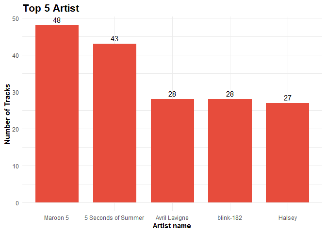
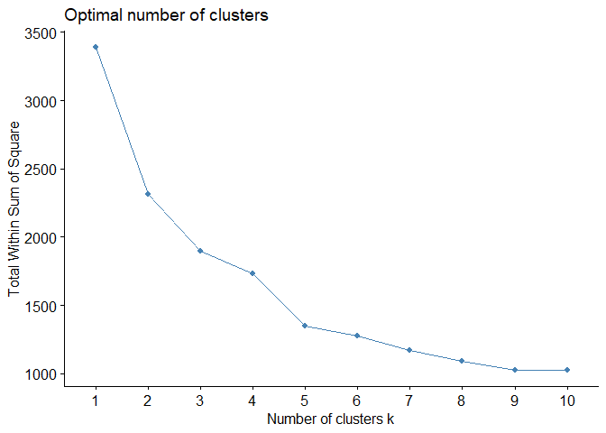
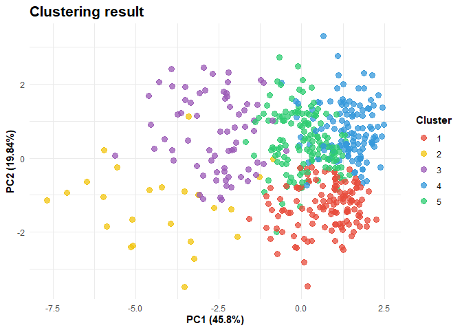
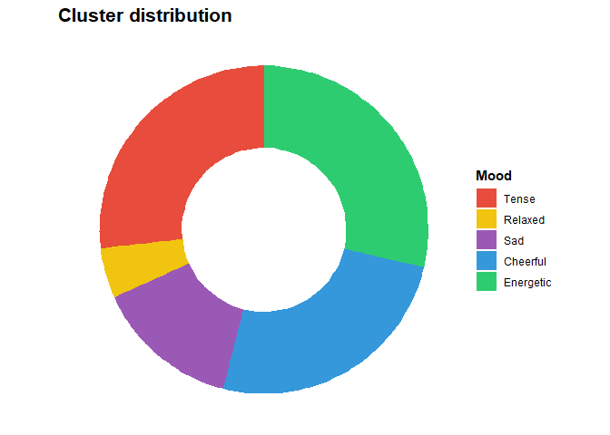
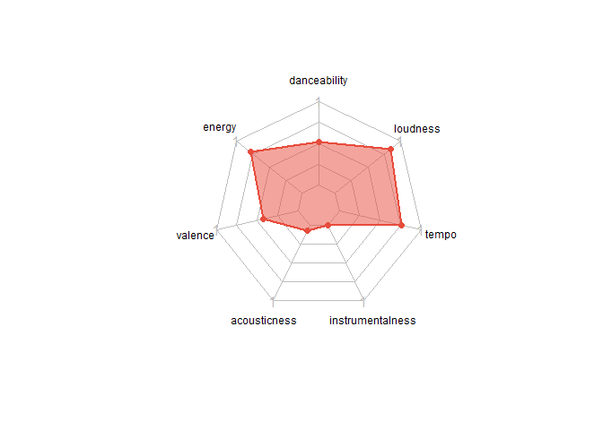
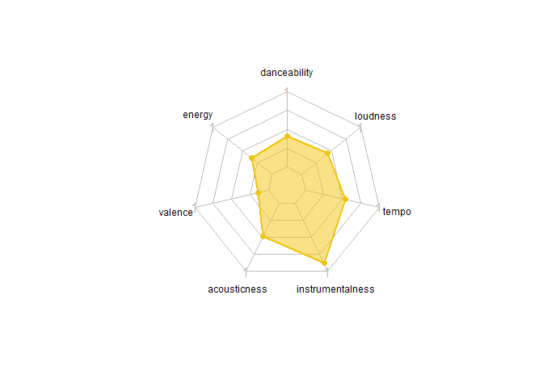
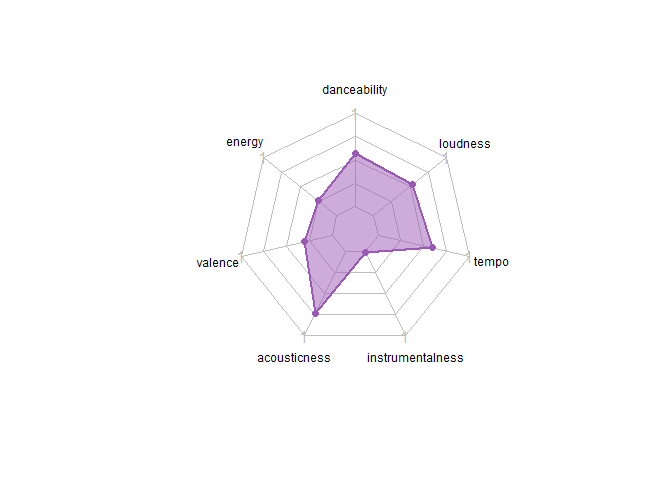
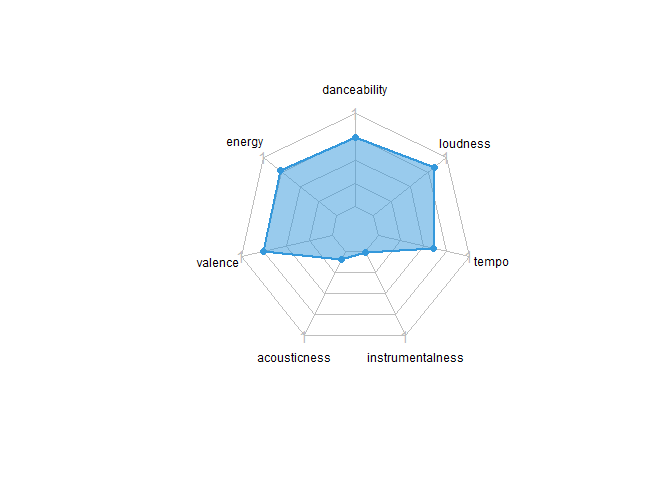
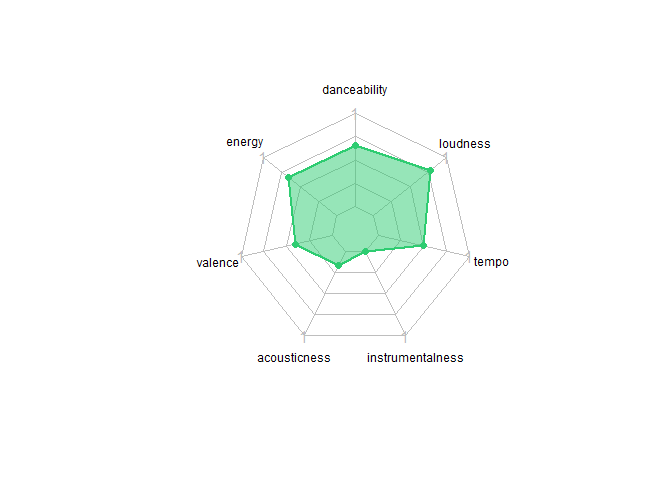

## Introduction

Music has powerful impacts on human beings. It can change emotions and
moods. A study \[1\] concluded that although listening to music before a
stressful event does not reduce anxiety, listening to relaxing music
after a stressful event can help your nervous system recover faster. In
2017, researchers \[2\] confirmed that exercising with music can improve
your mood, help your body exercise more effectively, and reduce your
awareness of fatigue. Workouts with music can also extend the duration
of the session.  
My partner is likely to spend more than 10 hours per week listening to
music on Spotify. Since she spends lots of time on it, I want to know
what type(s) of music she likes. Thus, to get a better understanding of
what my partner listened to, I’ll perform clustering analysis using the
K-means algorithm.

## Data Preparation

But first, I need to collect the data. To get the data, first, I seek
the access token for Spotify’s API from their
[website](https://developer.spotify.com/dashboard/). I logged in to my
Spotify account then I created a new application form. The access token:
client ID and client secret, can be copied afterward.

``` r
Sys.setenv(SPOTIFY_CLIENT_ID = "XXXXXXXXXXXXXXXXXXXXXXXXXXXX")
Sys.setenv(SPOTIFY_CLIENT_SECRET = "XXXXXXXXXXXXXXXXXXXXXXXXXXXX")
access_token <- get_spotify_access_token()
```

To get the desired playlist, I need to navigate through our own
saved/followed playlists. My partner’s playlist name that I want to
analyze is called “This is an experimental song to cluster modeling.”
Unfortunately, Spotify’s API limits the user to get playlist tracks up
to 100 items per request. Thus, I looped the process so I could get all
the tracks from the desired playlist.

``` r
my_playlist <- get_my_playlists()
target_playlist <- my_playlist %>% 
  filter(name == "This is an experimental songs to cluster modelling")
playlist_tracks <- lapply(c(0, 100, 200, 300, 400), function(x) {
  get_playlist_tracks(playlist_id = target_playlist$id, offset = x)
}) %>% 
  do.call(rbind, .) %>% 
  tibble()
playlist_tracks_table <- playlist_tracks %>% 
  transmute(
    track_ID = track.id,
    artist_name = map_chr(track.artists, function(x) x$name %>% str_flatten(", ")),
    track_name = track.name,x$name
    album_name = track.album.name,
    track_duration = ms(seconds_to_period(track.duration_ms/1000)),
    track_popularity = track.popularity,
    track_URL = track.external_urls.spotify
  ) %>% 
  mutate(feature = map(track_ID, ~get_track_audio_features(.))) %>% 
  unnest(feature) %>% 
  select(-c("key", "type", "mode", "id", "uri", "track_href", 
            "analysis_url", "duration_ms", "time_signature"))
```

### Data preview

Here are the first ten rows of the data and its variable description.

``` r
head(playlist_tracks_table, 10) 
```

    ## # A tibble: 10 x 16
    ##    track_ID  artist_name  track_name  album_name track_duration track_popularity
    ##    <chr>     <chr>        <chr>       <chr>      <Period>                  <int>
    ##  1 4m5HKGwU~ Jeff Bernat~ Call You M~ The Gentl~ 3M 35.125S                   63
    ##  2 7kM5vVmf~ grentperez   Confusing ~ Demo(s) A~ 4M 21.462S                   38
    ##  3 1zY2kLGU~ grentperez   Wait for Y~ Demo(s) A~ 4M 22.964S                   43
    ##  4 012iFI0w~ grentperez   In My Hear~ Demo(s) A~ 3M 24.661S                   41
    ##  5 6sG5MvSd~ grentperez   Dreams - D~ Demo(s) A~ 5M 14.956S                   49
    ##  6 75NuCOwu~ grentperez   (Only) Abo~ Demo(s) A~ 4M 18S                       57
    ##  7 7zYvkYcp~ grentperez   Confusing ~ Demo(s) A~ 3M 27.679S                   37
    ##  8 02QfV5ww~ grentperez   My Heart I~ My Heart ~ 3M 21.233S                   56
    ##  9 1a1Lrfgk~ grentperez   Cherry Wine Cherry Wi~ 2M 53.286S                   70
    ## 10 1THV5Yxg~ Two Steps f~ Miracles    Miracles   5M 29.785S                   38
    ## # ... with 10 more variables: track_URL <chr>, danceability <dbl>,
    ## #   energy <dbl>, loudness <dbl>, speechiness <dbl>, acousticness <dbl>,
    ## #   instrumentalness <dbl>, liveness <dbl>, valence <dbl>, tempo <dbl>

Variable description:

-   `track_id`: the Spotify ID for the track
-   `artist_name`: the name of the artist
-   `track_name`: the name of the track
-   `album_name`: the name of the album
-   `track_duration`: the duration of the track
-   `track_popularity`: the popularity of the track, 0-100 with 100
    being the most popular
-   `track_URL`: known external URLs of the track

``` r
p1 <- playlist_tracks_table %>% 
  count(artist_name) %>% 
  top_n(5, n) %>% 
  ggplot(aes(x = fct_reorder(artist_name, n, .desc = T), y = n)) +
  geom_col(width = 0.75, fill = colorParam[1]) +
  geom_text(aes(label = n), vjust = -0.5, size = 4) +
  labs(title = "Top 5 Artist", x = "Artist name", y = "Number of Tracks") +
  theme_minimal() +
  theme(plot.title = element_text(size = 16), 
        title = element_text(face = "bold"))
print(p1)
```


The top 5 artists, in her playlist, she listened to are Maroon 5, 5SOS,
Avril Lavigne, blink-182, and Halsey.

### Feature extraction

The next step is to extract each track’s features. The features I use to
do clustering analysis are:

-   `danceability`: danceability measures whether the track is suitable
    for dancing (0: least danceable, 1: most danceable)
-   `energy`: energy measures the intensity and activity of a track,
    less energy score means the track is less energetic
-   `valence`: valence measures the positiveness from a track, more
    valence score means the track is sound positive (happy, joy,
    cheerful)
-   `acousticness`: acousticness measures whether the track is acoustic,
    1 represent high confidence the track is acoustic
-   `instrumentalness`: instrumentalness measures the likelihood of a
    track containing vocals, a high score means the track is likely
    instrumental
-   `tempo`: the overall estimated tempo of a track in beats per minute
    (BPM)
-   `loudness`: the overall loudness of a track in decibels (dB)

Full documentation of the feature can be read
[here](https://developer.spotify.com/documentation/web-api/reference/#/operations/get-several-audio-features).
The data is standardized before clustering analysis.

``` r
playlist_tracks_feature <- playlist_tracks_table %>% 
  select(danceability, energy, valence, acousticness, 
         instrumentalness, tempo, loudness)
playlist_tracks_feature_std <- playlist_tracks_feature %>% 
  scale() %>% 
  as.data.frame() %>% 
  tibble()
```

``` r
head(playlist_tracks_feature_std, 10)
```

    ## # A tibble: 10 x 7
    ##    danceability energy valence acousticness instrumentalness  tempo loudness
    ##           <dbl>  <dbl>   <dbl>        <dbl>            <dbl>  <dbl>    <dbl>
    ##  1        1.72  -0.525   0.752        2.22            -0.159 -1.17   -0.0829
    ##  2       -0.474  0.307   1.18        -0.752           -0.251  0.938  -1.21  
    ##  3       -0.592 -1.50   -0.699        2.54            -0.214  1.87   -1.26  
    ##  4       -0.761 -1.22   -1.20         0.248           -0.250  1.11   -2.33  
    ##  5        1.09  -1.57   -0.228        1.34            -0.172  0.126  -2.31  
    ##  6        1.10  -0.803   0.584       -0.388            0.346  0.130  -1.56  
    ##  7        0.152  0.609   0.135       -0.769           -0.219  0.938   0.207 
    ##  8        0.926 -0.185   0.701       -0.573           -0.250 -0.261  -0.722 
    ##  9        1.48  -0.554   0.541        0.463           -0.251 -0.682  -0.290 
    ## 10       -1.98  -1.18   -1.59        -0.621            4.34   0.452  -1.16

## Clustering

### Elbow method

In K-means clustering, we need to specify the number of clusters (*k*)
we want to make. One of the methods that are often used is the **Elbow
method**.



From the plot above, the number of recommended cluster is *k* = 5.

### K-means clustering

``` r
set.seed(855)
cluster_model <- kmeans(playlist_tracks_feature_std, 
                        centers = 5L, nstart = 30, iter.max = 1e3)
playlist_tracks_table$cluster <- cluster_model$cluster
playlist_tracks_table %>% 
  group_by(cluster) %>% 
  summarize(across(c(danceability, energy, valence, acousticness, 
                     instrumentalness, tempo, loudness), mean))
```

    ## # A tibble: 5 x 8
    ##   cluster danceability energy valence acousticness instrumentalness tempo
    ##     <int>        <dbl>  <dbl>   <dbl>        <dbl>            <dbl> <dbl>
    ## 1       1        0.474  0.803   0.409       0.0705          0.00354  157.
    ## 2       2        0.370  0.422   0.133       0.485           0.856    111.
    ## 3       3        0.514  0.340   0.293       0.722           0.0110   122.
    ## 4       4        0.676  0.787   0.736       0.0922          0.0100   126.
    ## 5       5        0.595  0.686   0.394       0.162           0.00157  102.
    ## # ... with 1 more variable: loudness <dbl>

``` r
playlist_tracks_feature_PCA <- princomp(playlist_tracks_feature_std)
cluster_PCA <- playlist_tracks_feature_PCA$scores %>% 
  as.data.frame() %>% 
  set_names(str_c("PC", 1:7)) %>% 
  tibble()
cluster_PCA$cluster <- cluster_model$cluster
p2 <- cluster_PCA %>% 
  ggplot(aes(x = PC1, y = PC2, color = factor(cluster))) +
  geom_point(size = 3, alpha = 0.75) +
  labs(title = "Clustering result",
       x = "PC1 (45.8%)", y = "PC2 (19.84%)", 
       color = "Cluster") +
  scale_color_manual(values = colorParam) +
  theme_minimal() +
  theme(plot.title = element_text(size = 16), 
        title = element_text(face = "bold"))
print(p2)
```



To visualize the result in a 2D graph, we need to do PCA to reduce the
number of features. From the plot above, the x-axis is the first
principal component and the y-axis is the second principal component.
The first and second principal components contribute roughly
respectively 45.8% and 19.84% information from the data.

### Cluster profiling



Now, we are going to profile each cluster.


**Cluster 1 (Tense Mood):** high energy, loudness, and tempo  
Example tracks:

    1. Andy Black - Homecoming King
    2. ONE OK ROCK - Take What You Want (feat. 5 Seconds of Summer)
    3. Demi Lovato - Nightingale
    4. Maroon 5 - Animals
    5. 2NE1 - COME BACK HOME


**Cluster 2 (Relaxed Mood):** high instrumentalness and acousticness,
low danceability  
Example tracks:

    1. Two Steps from Hell, Thomas Bergersen - Science
    2. Two Steps from Hell, Thomas Bergersen - Lost in Las Vegas
    3. Two Steps from Hell, Thomas Bergersen - Forever in My Dreams
    4. Two Steps from Hell, Thomas Bergersen - Compass
    5. Two Steps from Hell, Thomas Bergersen - Men of Honor



**Cluster 3 (Sad Mood):** low valence and energy, high acousticness  
Example tracks:

    1. Payung Teduh - Cerita Tentang Gunung Dan Laut
    2. Ardhito Pramono - I Can't Stop Loving You
    3. Halsey - Sorry
    4. Taylor Swift - This Love
    5. Ardhito Pramono - cigarettes of ours



**Cluster 4 (Cheerful Mood):** high valence and energy  
Example tracks:

    1. Reality Club - Never Get Better
    2. 5 Seconds of Summer - She's Kinda Hot
    3. Justin Bieber - Runaway Love
    4. Maroon 5, Wiz Khalifa - Payphone
    5. 2NE1 - GOTTA BE YOU



**Cluster 5 (Energetic Mood):** high energy and danceability  
Example tracks:

    1. Halsey - Devil In Me
    2. blink-182 - 6/8
    3. Halsey - Strange Love
    4. Hyolyn - Tonight
    5. Maroon 5 - Not Coming Home

## Conclusion

In the end, I figured my partner’s playlist moods profile using
**K-means clustering** which are: Tense, Sad, Relaxed, Cheerful, and
Energetic. This moods profiling is based on my opinion and my partner’s
suggestions. *Turns out my partner likes to listen to energetic songs
:D*

## References

<div id="refs" class="references csl-bib-body">

<div id="ref-Myriam2013" class="csl-entry">

<span class="csl-left-margin">\[1\] </span><span
class="csl-right-inline">M. V. Thoma, R. L. Marca, R. Brönnimann, L.
Finkel, U. Ehlert, and U. M. Nater, “The effect of music on the human
stress response,” vol. 8, no. 8, p. e70156, Aug. 2013, doi:
[10.1371/journal.pone.0070156](https://doi.org/10.1371/journal.pone.0070156).</span>

</div>

<div id="ref-Thakare2017" class="csl-entry">

<span class="csl-left-margin">\[2\] </span><span
class="csl-right-inline">A. E. Thakare, R. Mehrotra, and A. Singh,
“Effect of music tempo on exercise performance and heart rate among
young adults,” *International journal of physiology, pathophysiology and
pharmacology*, vol. 9, no. 2, pp. 35–39, Apr. 2017,Available:
<https://pubmed.ncbi.nlm.nih.gov/28533890></span>

</div>

</div>
